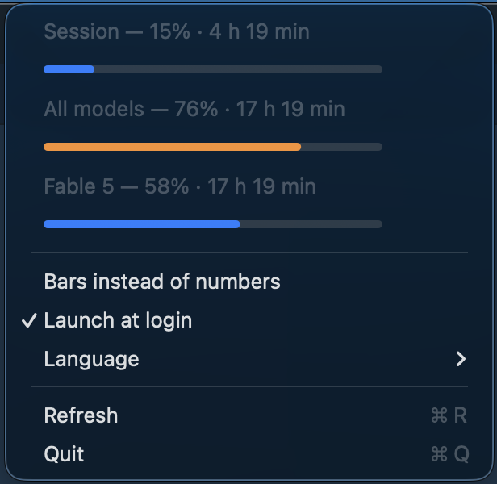

<div align="center">


# ClaudeLimits

Your Claude usage limits in the macOS menu bar. Three numbers, refreshed every five minutes.


&nbsp;&nbsp;


</div>

## What it shows

The same three limits as the Usage screen in Claude Code:

| Limit | What it covers |
|---|---|
| **Session** | The current 5-hour window |
| **All models** | The weekly limit across every model |
| **Fable** | The weekly limit for one specific model |

Each number is colored by the severity the API reports: normal label color, orange on `warning`, red on `critical`.

Clicking the status item opens a menu with percentages, time until reset, and a progress bar under every row:

<div align="center">

</div>

**Bars instead of numbers** switches the status item to a compact mode: three miniature charts in place of the digits. **Launch at login** registers the app through `SMAppService`, reading its state back from the system. **Language** overrides the interface language — see below.

## Install

Download the `.dmg` from [releases](../../releases) and drag the app into `/Applications`.

The app is ad-hoc signed, without an Apple developer certificate, so Gatekeeper blocks the first launch. Open it once via right click → **Open** → confirm, and it launches normally from then on. Or clear the quarantine flag yourself:

```bash
xattr -d com.apple.quarantine /Applications/ClaudeLimits.app
```

The app lives in the menu bar only — no Dock icon, no window.

## Language

English and Russian. By default the app follows the system, including the per-app language macOS offers under **Settings → General → Language & Region → Applications**. The **Language** submenu overrides that choice with `Automatic`, `English` or `Русский`, and applies it immediately without a restart.

## Build from source

```bash
./build.sh      # selftest → release build → icon → ClaudeLimits.app
./make-dmg.sh   # the same, plus ClaudeLimits-<version>.dmg
```

Requires Xcode with a Swift 6 toolchain and macOS 13+.

To check parsing and formatting without launching the UI:

```bash
swift run ClaudeLimits --selftest
```

## How it works

The app reads the OAuth token Claude Code keeps in the keychain (`Claude Code-credentials`, falling back to `~/.claude/.credentials.json`), and every five minutes — plus whenever the menu opens — requests:

```
GET https://api.anthropic.com/api/oauth/usage
Authorization: Bearer <token>
anthropic-beta: oauth-2025-04-20
```

Percentages come from the `limits` array rather than top-level fields like `seven_day_opus`, which the API returns as `null`. The scoped limit's label is read from `scope.model.display_name`, so renaming the model needs no code change.

The app never refreshes the token itself: Claude Code does that, and the keychain is re-read on every poll.

Nothing is sent anywhere except the request to `api.anthropic.com`. The token is never logged or written to disk.

## Releases

The version lives in the `VERSION` file, which `build.sh` stamps into `Info.plist`. To publish:

```bash
echo "1.1.0" > VERSION
git commit -am "chore: 1.1.0" && git push
git tag v1.1.0 && git push --tags
```

GitHub Actions builds the `.dmg` and creates the release. The workflow fails if the tag and `VERSION` disagree.

## Caveat

An unofficial project, not affiliated with Anthropic. It relies on an internal Claude Code endpoint that may change at any time — when it does, the menu bar shows `—` and the menu shows the error.

## License

MIT
