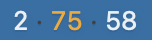
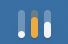

<div align="center">


# ClaudeLimits

Лимиты Claude в меню-баре macOS. Три числа, обновление каждые 5 минут.


&nbsp;&nbsp;


</div>

## Что показывает

Те же три лимита, что и экран Usage в Claude Code:

| Лимит | Что это |
|---|---|
| **Сессия** | Текущее 5-часовое окно |
| **Все модели** | Недельный лимит по всем моделям |
| **Fable** | Недельный лимит конкретной модели |

Каждое число красится по уровню, который отдаёт API: обычный цвет текста, оранжевый при `warning`, красный при `critical`.

Клик по элементу раскрывает меню с процентами, временем до сброса и прогресс-баром под каждой строкой:

```
Сессия — 41% · 55 мин
████████░░░░░░░░░░░░
Все модели — 74% · 18 ч 55 мин
███████████████░░░░░
Fable — 58% · 18 ч 55 мин
███████████░░░░░░░░░
─────────────────────────────
Полоски вместо цифр
Запускать при входе      ✓
─────────────────────────────
Обновить                ⌘R
Выход                   ⌘Q
```

**Полоски вместо цифр** — компактный режим: три мини-графика вместо чисел. **Запускать при входе** — автозапуск через `SMAppService`, состояние читается из системы.

## Установка

Скачай `.dmg` из [релизов](../../releases) и перетащи приложение в `/Applications`.

Приложение подписано ad-hoc, без сертификата разработчика Apple, поэтому при первом запуске Gatekeeper его заблокирует. Открыть один раз через правый клик → **Открыть** → подтвердить, дальше запускается обычным способом. Либо снять карантин вручную:

```bash
xattr -d com.apple.quarantine /Applications/ClaudeLimits.app
```

Приложение живёт только в меню-баре — иконки в Dock и окна у него нет.

## Сборка из исходников

```bash
./build.sh      # selftest → release-сборка → иконка → ClaudeLimits.app
./make-dmg.sh   # то же плюс ClaudeLimits-<версия>.dmg
```

Нужен Xcode с тулчейном Swift 6 и macOS 13+.

Проверка парсинга и форматирования без запуска UI:

```bash
swift run ClaudeLimits --selftest
```

## Как это работает

Приложение читает OAuth-токен, который Claude Code хранит в Keychain (`Claude Code-credentials`, с откатом на `~/.claude/.credentials.json`), и раз в 5 минут — а также при каждом открытии меню — запрашивает:

```
GET https://api.anthropic.com/api/oauth/usage
Authorization: Bearer <токен>
anthropic-beta: oauth-2025-04-20
```

Проценты берутся из массива `limits`, а не из полей верхнего уровня вроде `seven_day_opus` — те приходят `null`. Подпись модельного лимита читается из `scope.model.display_name`, поэтому переименование модели не требует правок в коде.

Токен не обновляется самим приложением: Claude Code делает это сам, а Keychain перечитывается на каждый опрос.

Ничего никуда не отправляется, кроме запроса к `api.anthropic.com`. Токен не логируется и не пишется на диск.

## Релизы

Версия живёт в файле `VERSION`, оттуда её берёт `build.sh` и подставляет в `Info.plist`. Публикация:

```bash
echo "1.1.0" > VERSION
git commit -am "chore: 1.1.0" && git push
git tag v1.1.0 && git push --tags
```

GitHub Actions собирает `.dmg` и создаёт релиз. Workflow падает, если тег не совпадает с содержимым `VERSION`.

## Оговорка

Неофициальный проект, с Anthropic никак не связан. Опирается на внутренний эндпоинт Claude Code, который может измениться в любой момент — тогда приложение покажет `—` и текст ошибки в меню.

## Лицензия

MIT
